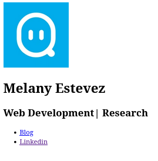
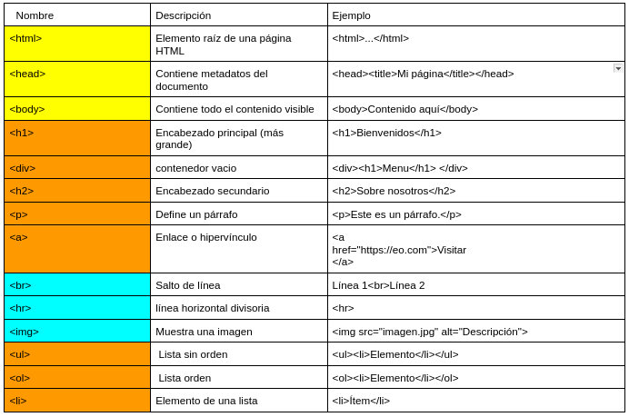

# TAREA - LINKTREE

### Linktree FINAL


## Desafios

### **Desafío 1: Crear un contenedor (`div`)**

**Tarea**: Crear un `div`  para el contenido de descripcion inicial. Este `div` es como una caja que mantendrá los elementos organizados.

* En el cuerpo del HTML, agrega una etiqueta `div` con la parte clase(class).

  Ejemplo:

  ```
  <div class=""><div>
  ```

```html
<body>
    <!-- Crear un div contenedor para mantener todos los elementos -->
    <!-- Aqui debes agregarlo  el div-->
</body>
```

### **Desafío 2: Sección de Biografía**

**Tarea**: Crear la primera sección de la página donde irá la imagen y el texto.

2. Dentro del `div`, agrega una imagen (``) con el atributo `src` apuntando a esta URL: `https://images.sketchaday.app/2020-07-30_4c72d2a0-1d81-4dca-be62-4a52fdadb84d.jpg`.
3. Agrega un encabezado (`<h3>`) en el texto debe ir tu nombre.
4. Debajo del encabezado h3, agrega otro encabezado (`<h6>`) con algún texto, como "Estudiante | Musico".

```html
<div>
    <!-- Agregar una imagen() con el atributo src para la foto de perfil -->
    <!-- Agregar encabezados para el nombre un h3 y la descripcion un h6 -->
</div>
```

## Recuerda las etiquetas

